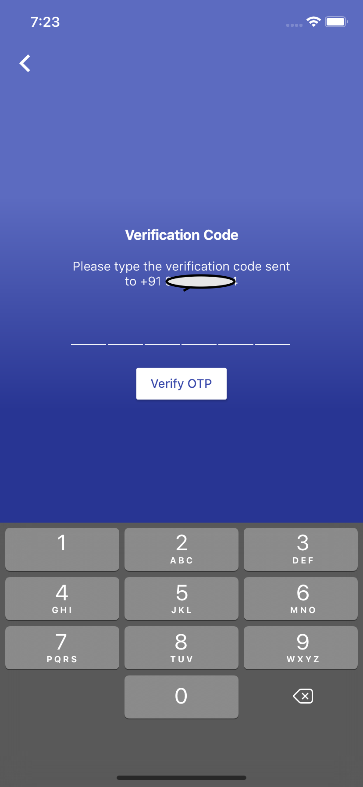

# underline_otp_text_field

Underline OTP TextField.

## Usage

```dart

final TextEditingController _otpTextFieldController = TextEditingController();

UnderlineOtpTextField(
      textColor: Colors.white,
      underLineColor: Colors.white,
      onValueChanged: (value){print(value);},
      controller: _otpTextFieldController,
      )
```


